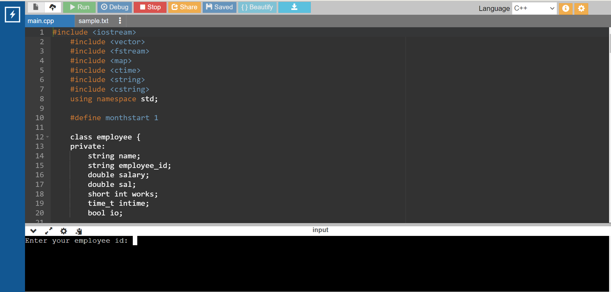
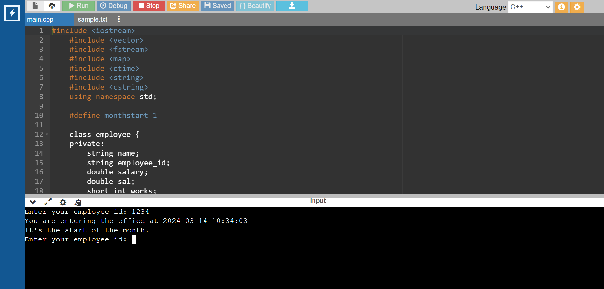
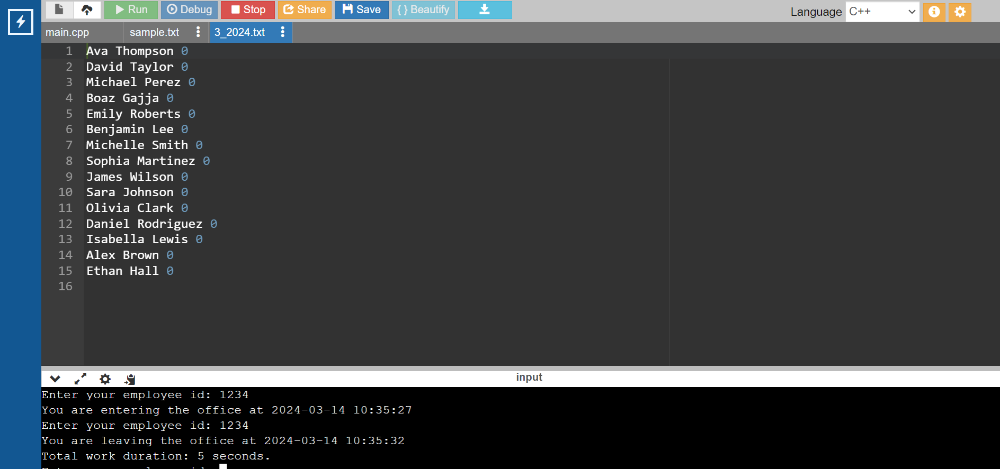

# EMPLOYEE-TRACKING-SYSTEM
The salary is calculated based on the time present in the office.

this code is to tracking employee present time during the office hours

after entering into the office you need to enter the employee id where as in real time we can use the fingerprint or card which has sensor

acually in the begin of the month it will atomatically create a file name monthnumber_year 

after every login and every logout it will calculate the time and add to the every employee at the end of the day it will add the total amount to the file according to their respective salary 

this is our project runing envirolment

you can see in the above image is saying that the time at login is 10:34 and 14 of march and 14 of march is not the month starting but it is showing that this is starting of the month that means no employee has logined on this month and the file has create in the below image

as above image after every logout it will show the time that he has worked so that they can know how much time left to do work .
if he or she will work for more than 8 hours also it will pay only 8 hours only 

<h2>Further extent of this project is to create GUI by GT</h2>
